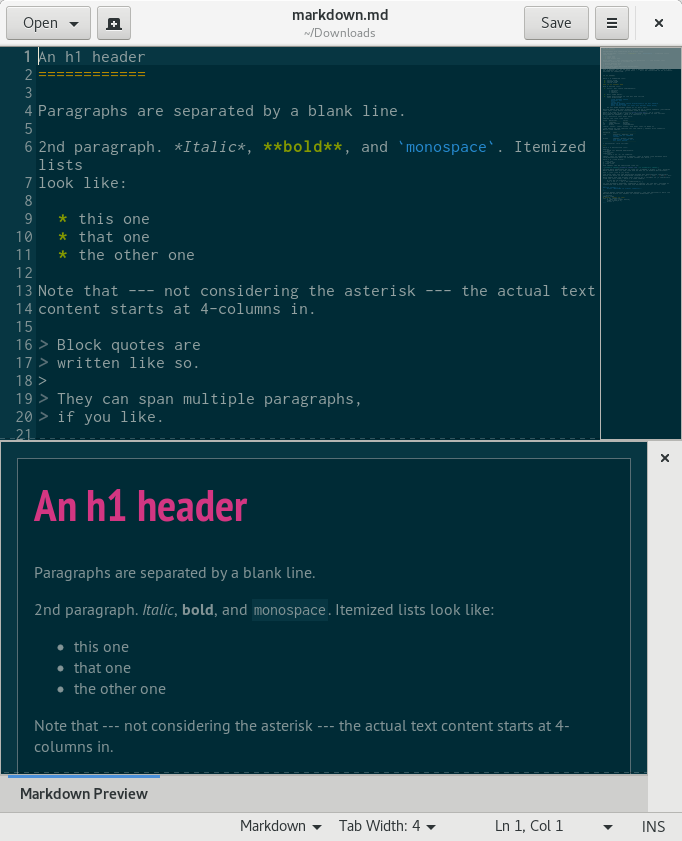

# Gedit Markdown Preview v3

**Note:** This version requires gedit 3.28 and WebKit**2** (`gir1.2-webkit2-4.0`).

**Old versions:**

- For gedit 2 or gedit 3.0 to 3.6, please refer to the [documentation of gedit-markdown v1](https://github.com/darkdragon-001/gedit-markdown/tree/v1#readme). 
- For gedit 3.8 and 3.10 with WebKit (`gir1.2-webkit-3.0`), please refer to the [documentation of gedit-markdown v2](https://github.com/darkdragon-001/gedit-markdown/tree/v2#readme).

## Overview

gedit-markdown adds support for Markdown preview in gedit, the default Gnome text editor.

Specifically, it adds:

- Markdown *snippets*

- plugin *Markdown Preview* for gedit, displayed in the side panel or the bottom panel and previewing in HTML the current document or selection

- an *external tool* for exporting to HTML or PDF the current document or selection

## Requirements

- gedit-markdown v3 supports gedit 3.28. It's shipped with an installer for GNU/Linux.

- The plugin *Markdown Preview* depends on the package `python3-markdown` and `gir1.2-webkit2-4.0`.

- Recommended: [PyMdown Extensions](https://facelessuser.github.io/pymdown-extensions/installation/)

## Installation (or update)

- Open a terminal

- Run the following commands in the terminal:

		git clone https://github.com/darkdragon-001/gedit-markdown.git
		cd gedit-markdown
		./gedit-markdown.sh install

Markdown support will be added for the current user (so no need root privileges). The folder created can be deleted after installation.

## Uninstallation

- Open a terminal in the project folder.

- Run the uninstaller in the terminal:

		./gedit-markdown.sh uninstall

## Usage

First of all, restart gedit if it's already running.

### Plugin *Markdown Preview*

To enable this plugin, go to *Edit > Preferences > Plugins* and check *Markdown Preview*.

Two items are added in the gedit menu *Tools*:

- *Update Markdown Preview*: displays in the side panel or in the bottom panel a preview in HTML of the current document or selection.

	Note: there are two other ways to update preview:
	
	  - with the keyboard shortcut *Ctrl+Alt+m* (can be changed in the configuration file);
	
	  - by right clicking on the preview area (side or bottom panel) and selecting the item *Update Preview*.

- *Toggle Markdown Preview visibility*: allows to display or hide the Markdown Preview panel tab.

	Note: the keyboard shortcut *Ctrl+Alt+v* (can be changed in the configuration file) can be used to do the same.

When right clicking on the preview area, a context menu appears and lists several options. Besides the default ones (previous page, next page, copy, etc.), we have:

- *Update Preview*: reloads in the side panel or in the bottom panel the preview in HTML of the current document or selection.

Local files will be followed in the preview area while global ones will be opened with your default web browser.

Here's a screenshot of the plugin when it's displayed in the bottom panel:

Now the same plugin displayed in the side panel (click to see the original image):

[![screenshot][2]][1]

  [1]: doc/exemple4-grand.png
  [2]: doc/exemple4-petit.png (Markdown Preview in the side panel of gedit.)

Note that when the cursor passes over a link in the preview area, a tooltip displays the URL:

### Table of contents

When the Markdown extension `toc` is enabled (see _Configuration file_, default), add `[TOC]` to your Markdown source to generate a table of contents with clickable links.

### Snippets

To use Markdown snippets, activate the plugin *Snippets* in *Edit > Preferences > Plugins*. Then, go to *Tools > Manage Snippets...* to see the possibilities.

### Converters (external tools)

The following tools are included:

- Export to HTML
- Export to PDF

To use the external tool, activate the plugin *External Tools* in *Edit > Preferences > Plugins*. Then, go to *Tools > External Tools > Export to HTML* to access the tool. The keyboard shortcut *Ctrl+Alt+h* does the same. The code of the currently opened Markdown file or the selection will be converted in HTML/PDF, and the result will be put in a new document.

To edit the tool, go to *Tools > Manage External Tools...*.

### Configuration file

The configuration file of gedit-markdown is located at:

	$XDG_CONFIG_HOME/gedit/gedit-markdown.ini

Most of the time, it will correspond to:

	$HOME/.config/gedit/gedit-markdown.ini

The section `markdown-preview` contains several properties:

- `panel`: emplacement of the preview. Possibles values: `bottom` (default value) or `side`.

- `shortcut`: shortcut to refresh the preview. The default value is `<Control><Alt>m`.

- `extensions`: a whitespace separated list of [Markdown extensions](https://python-markdown.github.io/extensions/#officially-supported-extensions). See link for possible values. Defaults to "extra toc".

- `visibility`: visibility of the Markdown Preview panel tab when gedit starts. Possible values: `0` (hidden) or `1` (displayed; default value).

- `visibilityShortcut`: shortcut to toggle Markdown Preview visibility. The default value is `<Control><Alt>v`.

- `autoIdle`: only update markdown after this idle time (in milliseconds). Possible values: `0` (update immediately), `250` (default), any positive `float`.

- `autoReload`: automatically reload the preview when the text is changed. Possible values: `0` (disabled) or `1` (enabled; default value).

- `autoReloadSelection`: automatically reload the preview when the selection is changed. Possible values: `0` (disabled) or `1` (enabled; default value).

Non-existent properties (as well as the whole file) will be generated with default values on startup.

### Examples

- [Demo 1](doc/demo-markdown.md)
- [Demo 2](doc/demo-markdown-extra.md)

## Localization

The plugin *Markdown Preview* is localizable. The file containing strings is `plugins/markdown-preview/locale/markdown-preview.pot`.

### Third-party code

The plugin *Markdown Preview* shipped with gedit-markdown is a modification of the [plugin of the same name written by Jean-Philippe Fleury](https://github.com/jpfleury/gedit-markdown), under the GPL v3 or any later version.
